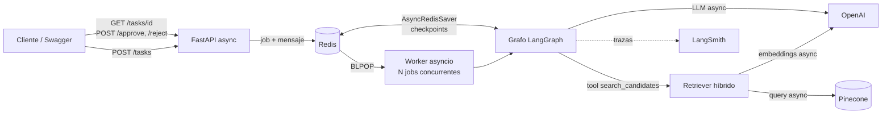
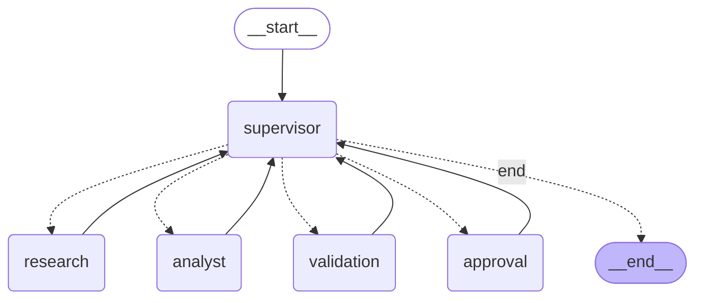

# Screening CVs — Sistema multi-agente con RAG, LangGraph y trazabilidad

**En 5 minutos, para un ingeniero senior:** una API asíncrona (FastAPI) recibe una vacante y la encola en Redis; un
worker `asyncio` ejecuta un grafo LangGraph en el que un **Supervisor** delega en un **Research Agent** (que consulta los
CVs vía **RAG híbrido sobre Pinecone**), un **Analyst Agent** (scores determinísticos + informe del LLM) y un nodo de
**Validation**; antes de cerrar, el grafo se **pausa para aprobación humana** (human-in-the-loop). El estado del grafo vive
en un **checkpointer Redis**, por lo que una conversación pausada sobrevive a reinicios del worker. Todo el I/O
(LLM, Pinecone, Redis) es `async`, cada frontera se valida con **Pydantic** y cada ejecución deja un árbol de spans en
**LangSmith**. Se levanta con un solo comando.

## Índice

1. [Arquitectura](#arquitectura) · 2. [Grafo de agentes](#grafo-de-agentes) · 3. [Decisiones de diseño](#decisiones-de-diseño)
4. [Ejecución con un comando](#ejecución-con-un-comando) · 5. [API](#api) · 6. [Pruebas y evidencia](#pruebas-y-evidencia)
7. [Estructura del repo](#estructura-del-repo) · 8. [Limitaciones conocidas](#limitaciones-conocidas)

## Arquitectura



Tres procesos independientes (más un job de ingesta): **API** (solo encola y consulta estado; nunca ejecuta el grafo),
**worker** (razonamiento) y **Redis** (cola, estado de los jobs y checkpoints). Se escalan por separado.

## Grafo de agentes

Diagrama generado con `python -m scripts.export_graph` a partir del grafo compilado (no se dibujó a mano):



| Nodo | Responsabilidad | Tools / dependencias |
|---|---|---|
| `supervisor` | Elige el próximo nodo. Salida estructurada `SupervisorDecision` (Pydantic). | LLM + guardrails |
| `research` | Recupera candidatos relevantes para la vacante. | `search_candidates` (RAG) |
| `analyst` | Calcula scores y redacta el informe. El LLM **no** calcula: interpreta. | `calculate_candidate_score` (determinística) |
| `validation` | Chequea el informe contra los scores (secciones, candidatos, recomendado = mayor score). | — |
| `approval` | `interrupt()` del grafo hasta recibir aprobación o rechazo humano. | Checkpointer |

Ciclo de reintento: si `validation` rechaza el informe, el supervisor vuelve a delegar en `analyst` pasándole el motivo
del rechazo (hasta `MAX_ANALYSIS_RETRIES`); agotados los reintentos el job termina en `FAILED` con la razón.

## Decisiones de diseño

- **RAG como tool del agente investigador.** Los CVs (`data/cvs/*.md`, 6 candidatos) se parten por sección, se embeben con
  OpenAI y se indexan en Pinecone; el perfil estructurado viaja como *metadatos* de cada chunk. La recuperación es
  **híbrida**: similitud densa (Pinecone) + re-ranking léxico, fusionados con *Reciprocal Rank Fusion*, y se agrupa por
  candidato. La tool acepta un filtro por metadatos (`min_experience_years`) que el LLM puede decidir usar.
- **Scores determinísticos, LLM solo para explicar.** Un LLM que calcula puntajes es una fuente de alucinaciones; el
  cálculo es código puro y testeable, y `validation` verifica que el informe respete esos números.
- **Supervisor: "el LLM propone, las reglas validan".** `legal_next()` deriva del estado las transiciones permitidas
  (con topes de reintentos). En modo `llm` (por defecto) el modelo elige entre ellas con salida estructurada; si propone
  algo ilegal o falla, se aplica la primera opción legal. `SUPERVISOR_MODE=rules` lo vuelve 100 % determinístico. Así
  se conserva la delegación autónoma sin que un error del modelo pueda producir un bucle infinito o saltarse la aprobación.
  Nota honesta: en el camino feliz solo hay una transición legal, así que el LLM confirma más que decide; su valor real
  aparece en los reintentos (reintentar vs. terminar).
- **Async de punta a punta.** `ChatOpenAI.ainvoke`, `OpenAIEmbeddings.aembed_*`, `PineconeAsyncio`, `redis.asyncio`,
  `AsyncRedisSaver` y `graph.ainvoke`. No hay `requests`, `time.sleep` ni clientes síncronos dentro del event loop.
  El worker procesa hasta `WORKER_CONCURRENCY` jobs a la vez y no saca trabajo de la cola si no tiene capacidad.
- **Checkpointer en Redis + HITL vía cola.** `POST /approve` no ejecuta el grafo: hace un *compare-and-set* atómico
  (`WAITING_APPROVAL → RUNNING`, script Lua) y encola un mensaje `resume`. Dos aprobaciones simultáneas no reanudan dos veces
  (la segunda recibe `409`) y cualquier worker puede continuar el job desde su checkpoint.
- **Pydantic en cada frontera:** request/response de la API (`extra="forbid"`), mensajes de la cola (unión discriminada),
  argumentos y resultados de las tools, perfil del candidato y salida del supervisor.
- **Configuración por entorno.** Modelos, índice de Pinecone, namespace, región, Redis, concurrencia y reintentos salen
  de variables de entorno (`app/config.py`, `.env.example`). No hay IDs ni nombres de modelo escritos en el código.
- **API 202 + polling.** El screening puede tardar segundos; la API responde de inmediato con un `job_id`.

## Ejecución con un comando

Requisitos: Docker (Compose v2) y claves de OpenAI y Pinecone (LangSmith opcional pero recomendado).

```bash
cp .env.example .env      # completar OPENAI_API_KEY, PINECONE_API_KEY, LANGSMITH_API_KEY
./run.sh                  # equivale a: docker compose up --build
```

`docker compose up` levanta Redis, **indexa los CVs en Pinecone** (crea el índice si no existe; es idempotente) y, cuando
termina, arranca el worker y la API. Luego:

- Swagger: <http://localhost:8000/docs> · RedisInsight: <http://localhost:8001>

Sin Docker (Python 3.12+):

```bash
python -m venv .venv && source .venv/bin/activate      # en Windows: .venv\Scripts\activate
pip install -r requirements-dev.txt
# Redis Stack local (RediSearch + RedisJSON son necesarios para el checkpointer):
docker run -d -p 6379:6379 redis/redis-stack-server:latest
python -m scripts.ingest_cvs
uvicorn app.main:app --port 8000 &   # API
python -m app.worker                 # worker
```

## API

| Método y ruta | Descripción |
|---|---|
| `POST /tasks` | Encola una vacante. `202` con `job_id`. |
| `GET /tasks/{job_id}` | Estado (`PENDING`, `RUNNING`, `WAITING_APPROVAL`, `DONE`, `REJECTED`, `FAILED`); con informe y scores al pausarse. |
| `POST /tasks/{job_id}/approve` | Aprueba y reanuda el grafo (`409` si no está esperando aprobación). |
| `POST /tasks/{job_id}/reject` | Rechaza: el job termina en `REJECTED`. Ambos aceptan `{"comment": "..."}`. |
| `GET /health` | Estado de la API y de Redis. |

```bash
curl -X POST localhost:8000/tasks -H 'content-type: application/json' -d '{
  "role": "Data Analyst", "experience": "2+ años", "python": "intermedio/avanzado",
  "sql": "intermedio/avanzado", "bi": "Power BI o equivalente",
  "statistics": "conocimientos aplicados", "financial_sector": "deseable"}'
# -> {"job_id":"...","status":"PENDING",...}
curl localhost:8000/tasks/<job_id>                      # -> WAITING_APPROVAL + informe + scores
curl -X POST localhost:8000/tasks/<job_id>/approve      # -> 202; luego GET -> DONE
```

## Pruebas y evidencia

**Tests unitarios y de integración ligera** (sin red ni API keys; LLM y Pinecone se reemplazan por dobles):

```bash
pip install -r requirements-dev.txt && pytest
```

Cubren scoring, chunking/retriever (incluido el filtro por metadatos), validación, supervisor (guardrail y fallback),
grafo completo con pausa/reanudación/rechazo, reintentos acotados (sin bucle infinito) y API + worker.

**5 pruebas end-to-end con el sistema levantado** (`./run.sh` en otra terminal):

```bash
python -m scripts.e2e_tests
```

1. Camino feliz: RAG → agentes → aprobación → `DONE`.
2. Rechazo humano → `REJECTED`.
3. Concurrencia: 5 jobs simultáneos.
4. Validación Pydantic y errores HTTP (`422`, `404`, `409`).
5. Persistencia: reinicio del worker con el grafo pausado y reanudación desde el checkpoint de Redis.

El script imprime los `job_id` y escribe `docs/evidence/e2e_report.md`. Las capturas del dashboard de LangSmith con el
árbol de spans, tokens y costo de cada prueba se guardan en [`docs/evidence/`](docs/evidence/README.md).

## Estructura del repo

```
app/
  main.py            API FastAPI (encola, consulta, aprueba/rechaza)
  worker.py          worker asyncio (ejecuta/reanuda el grafo)
  graph.py           construcción del grafo + AsyncRedisSaver
  state.py           estado compartido del grafo
  schemas.py         contratos Pydantic (API, cola, tools, supervisor)
  store.py           estado de jobs y cola sobre redis.asyncio
  config.py          Settings (variables de entorno)
  llm.py             LLM compartido
  observability.py   configuración de trazas LangSmith
  agents/            supervisor, research, analyst, validation, approval, tools
  rag/               documentos/chunking, vector store Pinecone async, retriever híbrido
scripts/             ingest_cvs, export_graph, e2e_tests
data/cvs/            base documental (CVs en Markdown con front matter)
tests/               pytest
docs/evidence/       capturas y reportes de las pruebas
```

## Limitaciones conocidas

- La rúbrica de scoring (pesos y niveles) está fija en `app/agents/tools.py` y orientada a perfiles de datos; para otras
  vacantes habría que parametrizarla.
- Si el worker muere *durante* un job (no pausado), el job queda en `RUNNING`: falta un mecanismo de re-encolado por timeout.
- El retriever híbrido re-rankea léxicamente los chunks que devuelve Pinecone; no usa vectores sparse nativos.
- Alcance de despliegue: local con Docker Compose, sin CI/CD ni nube (fuera de alcance de la entrega).
